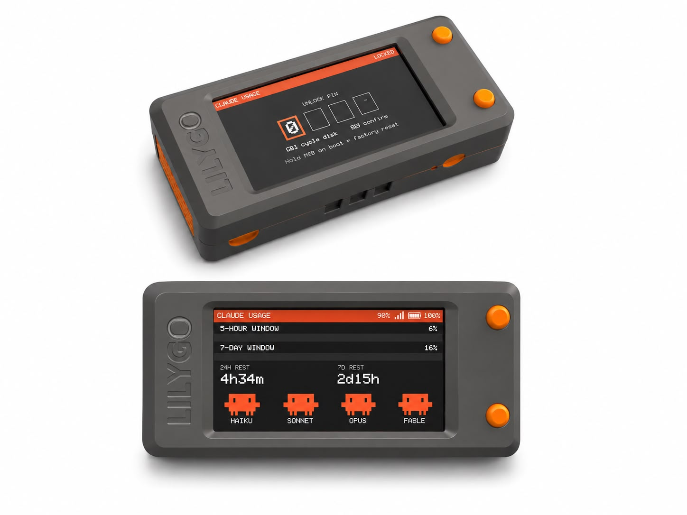
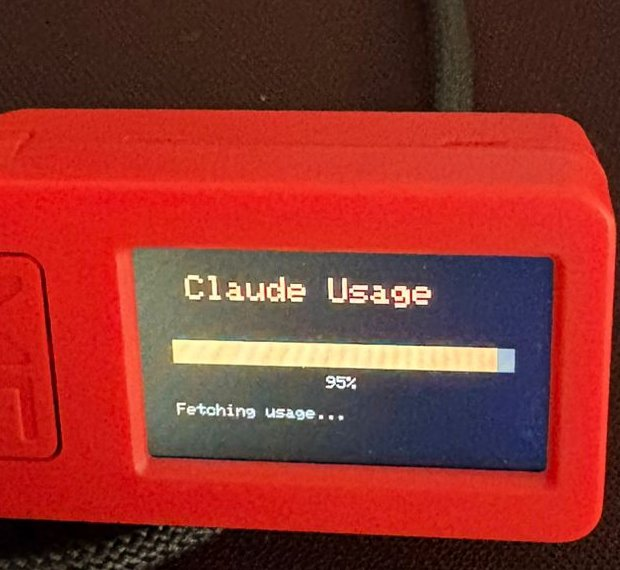
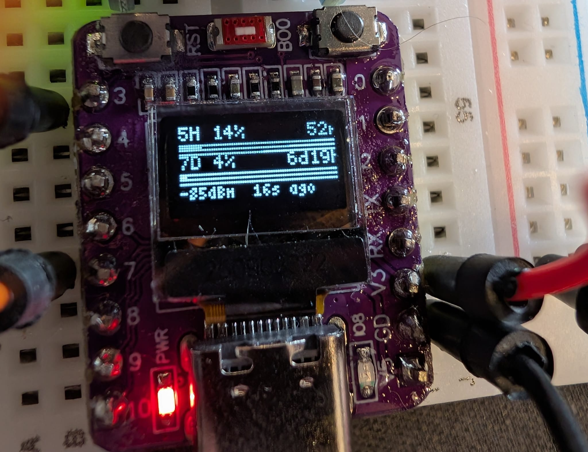

<div align="center">

# Claude Usage Stick

**Your [Claude Code](https://docs.anthropic.com/en/docs/claude-code) rate limits, glanceable on a tiny ESP32 stick.**

[-D97757?style=flat-square)](#-the-ui)
[](https://platformio.org/)
[](https://www.arduino.cc/)
[](#%EF%B8%8F-supported-hardware)
[](#-license)
[](https://github.com/oauramos/claude-usage-stick/pulls)



*5-hour & 7-day usage windows · reset countdowns · model health mascots · PIN-encrypted token*

</div>

---

A standalone desk gadget that polls the Anthropic API and shows your Claude Code rate-limit usage in real time — no computer, no app, no cloud. Flash it, connect it to WiFi from your phone, and it just sits there telling you how much runway you have left.

## ✨ Features

- **Live usage bars** for the 5-hour and 7-day rate-limit windows
- **Reset countdowns** so you know when capacity frees up
- **Model status** *(Mango)* — Haiku / Sonnet / Opus / Fable health from [status.claude.com](https://status.claude.com), shown as blinking Clawd mascots; a downed model turns gray with X eyes
- **PIN-protected** — your OAuth token is AES-256-GCM encrypted on-device; the PIN is never stored
- **Captive-portal setup** — connect your phone to the device's WiFi AP and configure everything in a browser
- **Battery & signal** shown on the dashboard
- **Button controls** — brightness, screen flip, force refresh, factory reset

## 🖥️ Supported hardware

Each board has its own spec page with pinouts, controls, and quirks — click the name.

| Board | MCU | Display | Firmware | PlatformIO env | Buy |
| ----- | --- | ------- | -------- | -------------- | --- |
| [M5StickC Plus](docs/m5stick-cplus.md) | ESP32-PICO | 1.14" 240×135 LCD | 🥭 **Mango (v2)** · tier S | `m5stick-cplus` | [AliExpress](https://s.click.aliexpress.com/e/_c3w3hHWl) |
| [M5StickC Plus2](docs/m5stick-cplus2.md) | ESP32-PICO-V3-02 | 1.14" 240×135 LCD | Clarity (v1) | `m5stick-cplus2` | [AliExpress](https://s.click.aliexpress.com/e/_c3jkKlNj) |
| [LilyGo T-Display S3](docs/tdisplay-s3.md) | ESP32-S3 | 1.9" 320×170 LCD | 🥭 **Mango (v2)** · tier L | `tdisplay-s3` | [AliExpress](https://s.click.aliexpress.com/e/_c4rvB1Mv) |
| [LilyGo T8 ESP32-S2](docs/t8-s2.md) | ESP32-S2 | 1.14" 135×240 LCD | Clarity (v1) | `t8-s2` | [AliExpress](https://s.click.aliexpress.com/e/_c2w1HnpJ) |
| [Elecrow CrowPanel Advance 3.5"](docs/crowpanel-adv-35.md) | ESP32-S3 | 3.5" 480×320 IPS touch | Clarity (v1) | `crowpanel-adv-35` | [AliExpress](https://s.click.aliexpress.com/e/_c4lDErmN) |
| [LilyGo T-Display S3 AMOLED 1.91"](docs/tdisplay-s3-amoled.md) | ESP32-S3 | 1.91" 240×536 AMOLED | Clarity (v1) | `tdisplay-s3-amoled` | [AliExpress](https://s.click.aliexpress.com/e/_c3XNB9Hx) |
| [TTGO T-Display ESP32](docs/tdisplay-esp32.md) | ESP32 | 1.14" 135×240 LCD | Clarity (v1) | `tdisplay-esp32` | [AliExpress](https://s.click.aliexpress.com/e/_c32HlGQ1) |
| [ESP32-C3-OLED](docs/esp32c3-oled.md) | ESP32-C3 | 0.42" 72×40 OLED | Clarity (v1) | `esp32c3-oled` | [AliExpress](https://s.click.aliexpress.com/e/_c3JMxywv) |
| M5Stack StickS3 | — | — | 🚧 in progress | — | [AliExpress](https://s.click.aliexpress.com/e/_c3ZsWHBB) |

Plus any USB-C cable for flashing and power.

## 🎨 The UI

Firmware releases carry names. Each board's current version is listed in the table above.

### Versions

| Version | Name | Highlights |
| ------- | ---- | ---------- |
| v1 | **Clarity** | The original dashboard — usage bars, reset countdowns, PIN unlock, captive-portal setup |
| v2 | 🥭 **Mango** | Everything in Clarity, plus model-status mascots, header icons, inline countdowns, and screen flip — see below |

### Display tiers

The Mango dashboard keeps the same header and usage bars on every board, and adapts only its bottom **MODELS** section to the screen size. Each tier has a reference board; the layout scales to fit.

| Tier | Class | Resolution | Reference board | MODELS section | Status |
| ---- | ----- | ---------- | --------------- | -------------- | ------ |
| **XS** | tiny OLED | ≤ 128×64 | ESP32-C3-OLED | — | ⏳ Pending |
| **S** | small LCD | ~240×135 | **M5StickC Plus** | One overall-health Clawd + a 2×2 `NAME UP/DOWN` text grid | ✅ |
| **L** | large LCD | ~320×170 | **LilyGo T-Display S3** | A row of four labelled Clawds (one per model), each blinking when healthy | ✅ |
| **XL** | big / touch | ≥ 480×320 | CrowPanel 3.5", S3 AMOLED | — | ⏳ Pending |

> Boards still on **Clarity (v1)** keep the original minimal dashboard until they're migrated to their tier.

### What Mango adds

- **Model status mascots** — Haiku / Sonnet / Opus / Fable health from the Claude status page; a downed model turns gray with X eyes, healthy ones blink
- **Header icons** — battery level and WiFi signal strength as icons in the header bar
- **Inline reset countdowns** — each usage bar shows its own reset time on the bar row, freeing the bottom of the screen for the MODELS section
- **Dashboard-styled PIN screen** — the unlock screen matches the dashboard look
- **Screen flip & brightness** — Button A flips the screen 180°, Button B cycles brightness; refresh happens automatically

## 🚀 Quick start

### Prerequisites

- [PlatformIO CLI](https://platformio.org/install/cli) installed
- A supported board connected via USB-C
- A Claude Code OAuth token (run `claude setup-token` in your terminal)

### 1. Flash the firmware

Pick your board's env from the [hardware table](#%EF%B8%8F-supported-hardware), then:

```bash
git clone https://github.com/oauramos/claude-usage-stick.git
cd claude-usage-stick

pio run -e <env> -t upload      # firmware
pio run -e <env> -t uploadfs    # web setup UI (SPIFFS)
```

> **Apple Silicon note:** If `uploadfs` fails with "Bad CPU type", install Rosetta (`softwareupdate --install-rosetta`) or use the included Python fallback:
> ```bash
> python3 upload_data.py
> ```

### 2. Configure the device

1. On first boot (or after factory reset), the device creates a WiFi access point named `ClaudeMonitor-XXXX`
2. Connect your phone or laptop to that network — the password is shown on the device screen
3. Open `http://192.168.4.1` in a browser
4. Fill in your WiFi credentials, OAuth token, and a 4-digit encryption PIN
5. Hit **Save & Reboot** — the device encrypts the token, stores it, and connects to your WiFi

### 3. Daily use

On each boot, enter your PIN using the device buttons: **Button A** cycles the current digit (0–9), **Button B** confirms and moves to the next. Once unlocked, the dashboard appears and auto-refreshes.

| Button | Clarity (v1) | 🥭 Mango (v2) |
| ------ | ------------ | ------------- |
| A | Cycle brightness | Flip screen 180° |
| B | Force refresh | Cycle brightness |
| A+B held on boot | Factory reset | Factory reset |

> Single-button and touch boards (T8-S2, CrowPanel, AMOLED, ESP32-C3-OLED) map these differently — see your [board's page](#%EF%B8%8F-supported-hardware).

## ⚙️ How it works

1. The device sends a minimal API request (`max_tokens: 1`) to the Anthropic Messages endpoint using your OAuth token
2. It reads the `anthropic-ratelimit-unified-5h-utilization` and `anthropic-ratelimit-unified-7d-utilization` response headers
3. The dashboard updates on a configurable interval (30s–5min)

The token never leaves the device. It is encrypted with AES-256-GCM using a key derived from your PIN (PBKDF via iterated SHA-256, 10 000 rounds).

## 🔐 Security

- The OAuth token is encrypted with AES-256-GCM before being written to NVS flash
- The encryption key is derived from your PIN + device MAC salt through 10 000 rounds of SHA-256
- The PIN is **never stored** — wrong PIN = failed decryption (GCM tag mismatch)
- After 10 failed PIN attempts, all credentials are wiped and the device resets to setup mode
- Lockout delay doubles after each failure (60s → 120s → 240s → ...)

## 🗂️ Project structure

```
assets/           — images (hero, gallery, wiring photos)
docs/             — per-board hardware specs, flashing & controls
src/
  main.cpp        — boot flow, WiFi, PIN entry, main loop
  hal.cpp/h       — hardware abstraction (display, buttons, battery, backlight)
  api.cpp/h       — HTTPS request to Anthropic, header parsing
  crypto.cpp/h    — AES-256-GCM encrypt/decrypt with PIN-derived key
  provision.cpp/h — captive portal WiFi AP + web server
  ui.cpp/h        — all LCD drawing (boot, PIN, dashboard, errors)
  config.h        — tunables (poll interval, timeouts, PIN attempts)
data/
  setup.html      — web UI served during provisioning
server/
  usage_proxy.py  — optional local caching proxy (reads token from macOS Keychain)
platformio.ini    — one build env per board
```

## 📸 Gallery

Real builds in the wild. Got a Claude Usage Stick on your desk? PRs with photos are welcome!

<p align="center">
  
  
  
</p>

<p align="center">
  
</p>

## 📄 License

MIT
