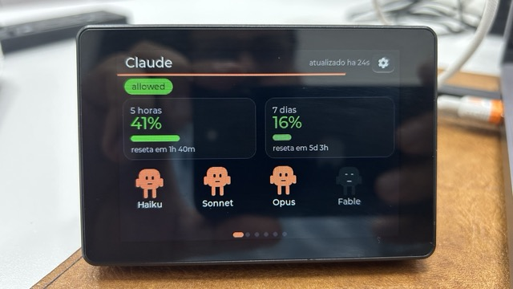
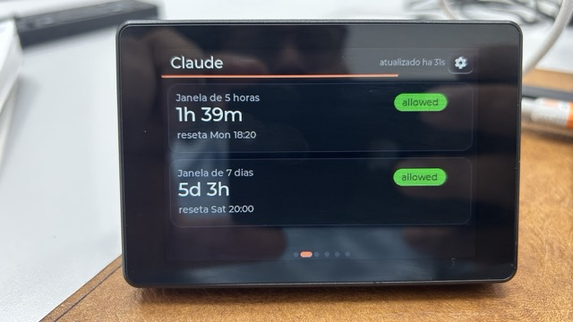
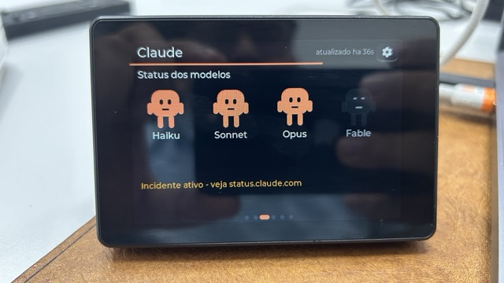
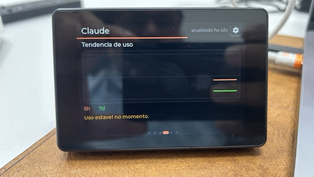
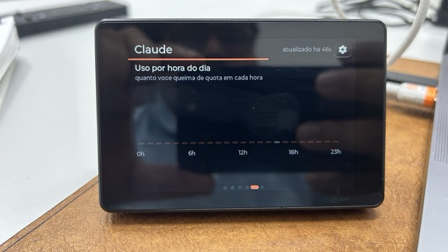
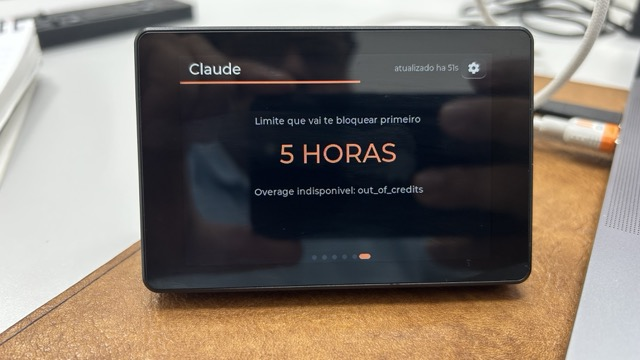
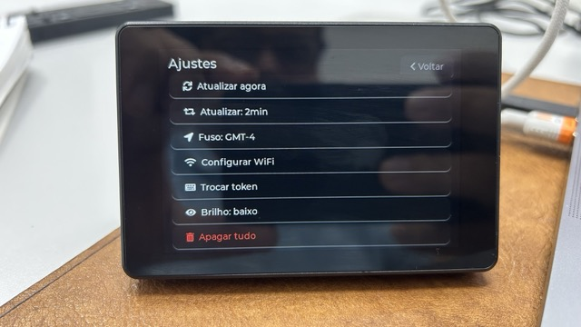

# Claude Usage Stick — touch screen (ESP32-S3 + LVGL)

A desk gadget that shows your **Claude Code rate-limit usage** in real time on a 3.5" touch
screen. No computer, no app, no cloud: the device queries Anthropic's API directly, reads usage
straight from the response headers, and renders it all on a friendly dashboard — with animated
**Clawd** mascots, a usage trend chart, an hour-of-day heatmap and reset clocks.

<p align="center">
  
</p>

> 100% touch navigation (swipe ← → between screens, no physical button). Adapted from the original
> **Claude Usage Stick** project (a multi-board firmware with physical buttons) to run **on this
> screen only** — see [What came from the original project](#what-came-from-the-original-project).

> The on-screen UI is in Portuguese (the author's language). This README documents it in English;
> screenshot labels are referenced where useful.

---

## Screens

Navigate by **swiping** (the dots at the bottom show your position; the active one becomes a
pill). The **gear** opens Settings. The thin **coral bar** below the header counts down to the
next refresh — tapping it refreshes immediately.

### 1. Overview (*Resumo*)


- **Overall status chip** (`allowed` / `allowed_warning` / `rejected`), color-coded.
- **5-hour card** and **7-day card**: large percentage colored by threshold
  (green < 70 % · amber < 90 % · red ≥ 90 %), a progress bar and a live *"resets in …"*.
- **Row of Clawd mascots** (Haiku / Sonnet / Opus / Fable): coral = online (they blink and gently
  bob), gray/translucent = offline.
<br clear="right">

### 2. Reset clocks (*Reset*)


- Two cards (5 h and 7 d windows) with a **large countdown** and the **local reset time**
  (*"resets Mon 18:20"*) — respects the configured timezone.
- A **status pill** per window.
<br clear="right">

### 3. Models (*Modelos*)


- The 4 mascots at large size, with **name** and **online/offline** state.
- An **incident banner**: *"Active incident — see status.claude.com"* or *"All models OK"*, read
  from `status.claude.com`. Handy to know whether the problem is you or Anthropic.
<br clear="right">

### 4. Trend (*Tendência*)


- A **line chart** of recent usage: 5 h (coral) and 7 d (green).
- A **burn-rate** sentence in plain language: *"Usage stable right now"* or *"At the current
  rate, the 5 h window fills in ~2h10m"*.
<br clear="right">

### 5. Heatmap


- **Usage by hour of day**: 24 bars (0 h–23 h) whose height and brightness show **which hours you
  burn the most quota**. The current hour is highlighted.
- Accumulates over days and is **persisted to flash** — great for planning big refactors right
  after a reset.
<br clear="right">

### 6. Details (*Detalhes*)


- Minimalist: **"The limit that will block you first"** → **5 HOURS** or **7 DAYS** (from the
  `representative-claim` header), plus the **overage** state when relevant.
<br clear="right">

### Settings (*Ajustes*)


Opened from the gear:

- **Refresh now** — forces a refresh.
- **Refresh interval** — 30 s / 1 min / 2 min / 5 min (tap to cycle; saved to NVS).
- **Timezone: GMT±N** — adjusts the timezone (tap to cycle; fixes the reset clocks).
- **Configure WiFi** — re-scan + password on screen.
- **Change token** — reopens the web token entry.
- **Brightness** — low / medium / high (backlight PWM).
- **Erase everything** — factory reset (2 taps to confirm).
<br clear="right">

---

## Hardware

| | |
|---|---|
| Screen | **Mini ESP32-S3 3.5" Capacitive Touch IPS · 480×320 · 8 MB PSRAM · 16 MB Flash** ([AliExpress](https://pt.aliexpress.com/item/1005007641039070.html)) |
| Chip | ESP32-S3 (native USB) |
| Display | **AXS15231B**, QSPI interface |
| Touch | **AXS15231B** capacitive, I²C `0x3B` |

> **OPI PSRAM is mandatory** — the 480×320 LVGL buffer doesn't fit in internal RAM.

Pins and the validated display/color/touch configuration are in
[`firmware/REFERENCIA-HARDWARE-LVGL.md`](firmware/REFERENCIA-HARDWARE-LVGL.md) and the reference
bring-up sketch in [`firmware/bringup/`](firmware/bringup/).

---

## How it works (and the token)

The gadget makes a **minimal** `POST` (`max_tokens: 1`) to
`https://api.anthropic.com/v1/messages` and **doesn't use the response body** — it reads usage
straight from the headers:

```
anthropic-ratelimit-unified-status                allowed | allowed_warning | rejected
anthropic-ratelimit-unified-5h-utilization        0–1   (becomes the 5-hour window %)
anthropic-ratelimit-unified-5h-reset              epoch
anthropic-ratelimit-unified-7d-utilization        0–1   (7-day window)
anthropic-ratelimit-unified-7d-reset              epoch
anthropic-ratelimit-unified-representative-claim  five_hour | seven_day  (what limits you first)
anthropic-ratelimit-unified-fallback-percentage
anthropic-ratelimit-unified-overage-status / -overage-disabled-reason
```

Model health comes from `status.claude.com/api/v2/incidents/unresolved.json`.

### Generating the token (`claude setup-token`)

In a terminal, with **Claude Code** installed and logged into your subscription (**Pro** or
**Max**):

```bash
claude setup-token
```

This opens an **OAuth** flow in the browser; you authenticate with your Anthropic account and
receive a **long-lived token** in the form `sk-ant-oat01-…`.

It was designed for environments **without interactive login** (CI/CD, GitHub Actions, headless
scripts) — the typical use is as an environment variable:

```bash
export CLAUDE_CODE_OAUTH_TOKEN="sk-ant-oat01-..."
```

**⚠️ Important caveat:** this is a **Claude Code** token. A "raw" call to the Messages API
(`/v1/messages`) with it is usually **rejected**.

**How this gadget works around that:** it sends exactly the headers Claude Code sends —
`anthropic-beta: oauth-2025-04-20` plus the Claude Code `User-Agent` — in a `max_tokens: 1`
request. The API then responds **200** and returns the rate-limit headers (validated against a
real account). Since the body is discarded and it's just 1 token, **quota consumption is
negligible**.

> The token is typed **once** (via the web, see below) and stored **encrypted** on the device.

---

## Build & flash

Prerequisites (tested versions):

- `arduino-cli` 1.4.x · core `esp32:esp32` **3.3.8**
- libraries: **GFX Library for Arduino** 1.6.5 · **lvgl** 9.2.2

```bash
cd firmware/claude_stick
./build.sh                 # compile
./build.sh upload          # compile + flash (default port /dev/cu.usbmodem101)
./build.sh upload /dev/cu.usbmodemXXXX
./build.sh monitor /dev/cu.usbmodemXXXX
```

FQBN: `esp32:esp32:esp32s3:PSRAM=opi,FlashSize=16M,PartitionScheme=custom,CDCOnBoot=cdc,USBMode=hwcdc,FlashMode=qio`

`build.sh` passes `-DLV_CONF_INCLUDE_SIMPLE -I<sketch>` so LVGL finds the sketch's `lv_conf.h`. If
you get `lv_conf.h not found`, copy `firmware/claude_stick/lv_conf.h` into your Arduino libraries
folder (one level above the `lvgl` folder).

> If colors come out with red/blue swapped, flip `LV_COLOR_16_SWAP` to `1` in `lv_conf.h`.

---

## First-time setup (onboarding)

Everything via the screen / network — no recompiling needed:

1. **WiFi** — tap your network and type the password (on-screen keyboard). Stores up to 3 networks
   in NVS.
2. **Token** — the screen shows the **gadget's IP** (e.g. `http://192.168.0.42`) with an animated
   Claude icon. Open that address **on your PC/phone on the same network** and **paste the token**
   into the form. The device **validates** the token on the spot (a real API call) before
   accepting it.
3. **PIN** — set a 4-digit PIN (entered twice to confirm). The token is encrypted with it.

On every subsequent boot, the device only asks for the **PIN** to decrypt the token.

---

## Security

- The token is stored **encrypted** (AES-256-GCM; key derived from the PIN via SHA-256). The PIN
  is **never** stored — a wrong PIN means the GCM tag fails to verify.
- After 10 wrong attempts, the credentials are **wiped** and the device returns to onboarding
  (each failure doubles the lockout time).
- The history/heatmap lives in a **LittleFS** file (it does not contain the token).
- `.env` and `.mcp.json` are in `.gitignore` — **no secrets go to git**.

---

## What came from the original project

This is a fork of the **Claude Usage Stick** (a multi-board firmware with physical buttons). The
**data mechanics were reused** and the entire **hardware/UI layer was rewritten** for this screen.

**Reused from the original (adapted):**

- The core idea of **reading usage from the** `anthropic-ratelimit-unified-*` **headers** with a
  minimal `POST` (`firmware/claude_stick/api.cpp`).
- The **model-health** fetch from `status.claude.com` (`status.cpp`).
- The **token encryption** AES-256-GCM + PIN-derived key (`crypto.cpp`).
- The **CA bundle** for HTTPS (`certs.cpp`).
- The product concept and the **Clawd mascots** / model-status row.

**Rewritten / new in this version:**

- **LVGL 9 UI** for the touch screen (tileview with swipe + dots, cards, mascots with arms/legs,
  chart, heatmap) — replacing the multi-board TFT_eSPI/U8g2.
- **arduino-cli build** for the ESP32-S3 (replacing the multi-board PlatformIO setup).
- **Touch navigation** instead of physical buttons.
- **On-screen onboarding + web token entry** (local IP) instead of a captive portal.
- **Full** header parsing (status, `representative-claim`, overage, fallback).
- **Background refresh**, **persisted history/heatmap** (LittleFS), **configurable timezone**.

---

## Repository layout

```
firmware/
  claude_stick/                 # the firmware (arduino-cli sketch)
    claude_stick.ino            # setup/loop, state machine, dashboard, screens
    api.cpp/.h                  # fetchUsage() — usage via API headers
    status.cpp/.h               # fetchModelStatus() — model health
    crypto.cpp/.h               # AES-256-GCM + PIN-derived key
    certs.cpp/.h                # CA bundle for HTTPS
    wifi_manager.h              # networks saved in NVS (up to 3)
    touch.h                     # AXS15231B driver
    config.h                    # pins + endpoints + constants
    lv_conf.h                   # LVGL 9.2 config
    partitions.csv              # 16 MB partition (app + nvs + LittleFS)
    build.sh                    # compile / flash / monitor
  bringup/                      # validated bring-up (hardware reference)
  REFERENCIA-HARDWARE-LVGL.md   # display/colors/touch that work
assets/                         # screen screenshots
```

## Where to tweak

- **Poll interval, endpoints, PIN, timezone:** via the screen (Settings) or in `config.h`.
- **Theme colors / layout:** top of `claude_stick.ino` (palette) and the `build_tile_*` builders.
- **Mascots:** `build_mascot()` in `claude_stick.ino`.

---

## Credits

Fork of the original **Claude Usage Stick**. This version's firmware was rewritten for the
ESP32-S3 480×320 LVGL screen. Not an official Anthropic product.
