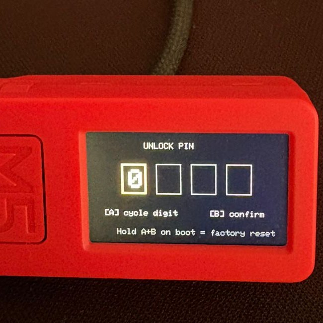
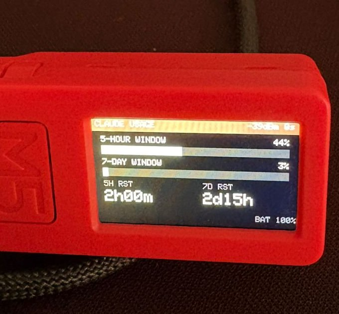
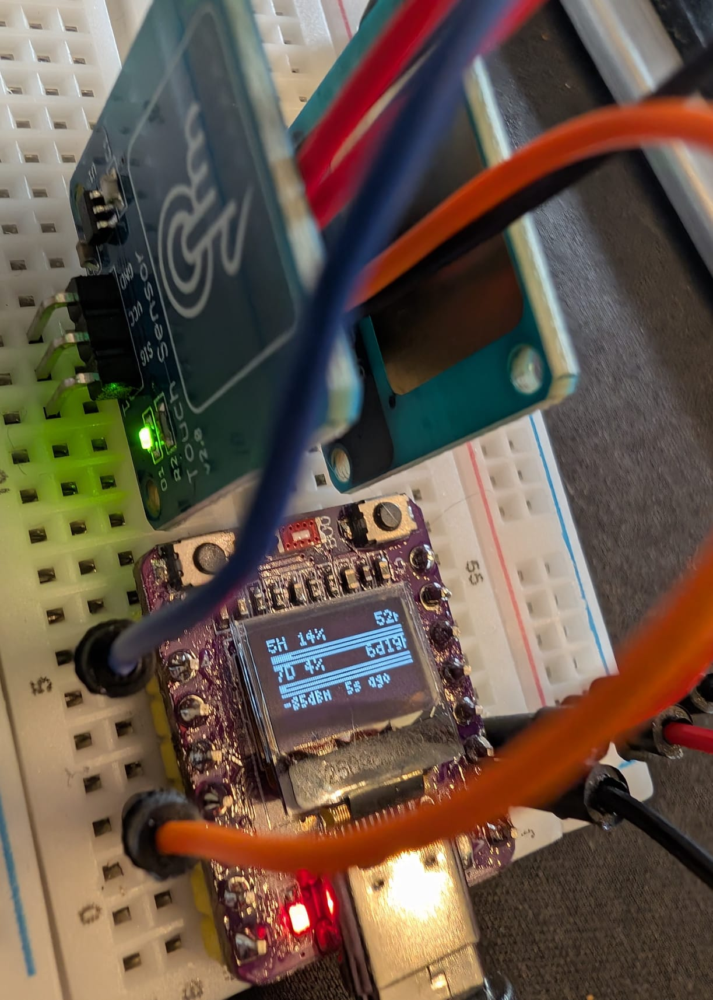

# Claude Usage Stick

A tiny standalone device that shows your [Claude Code](https://docs.anthropic.com/en/docs/claude-code) rate-limit usage in real time. Polls the Anthropic API and displays your 5-hour and 7-day usage windows, reset countdowns, signal strength, and battery level.

Supports eight boards:
- **M5StickC Plus** (ESP32-PICO, 240x135 LCD)
- **M5StickC Plus2** (ESP32-PICO-V3-02, 240x135 LCD)
- **LilyGo T-Display S3** (ESP32-S3, 320x170 LCD)
- **LilyGo T8 ESP32-S2** (ESP32-S2, 1.14" 135x240 ST7789 LCD)
- **Elecrow CrowPanel Advance 3.5" HMI** (ESP32-S3, 480x320 IPS ILI9488 + GT911 touch)
- **LilyGo T-Display S3 AMOLED** 1.91" (ESP32-S3, 240x536 RM67162 AMOLED — H712/H713/H705/H681/H717)
- **TTGO T-Display ESP32** (ESP32, 1.14" 135x240 ST7789 LCD)
- **ESP32-C3-OLED** (ESP32-C3, 0.42" 72x40 OLED) — breadboard-friendly; bring your own buttons

<p align="center">
  
  
  
</p>

<p align="center">
  
</p>

## Features

- **Live usage bars** for the 5-hour and 7-day rate-limit windows
- **Reset countdowns** so you know when capacity frees up
- **PIN-protected** — your OAuth token is AES-256-GCM encrypted on-device; the PIN is never stored
- **Captive-portal setup** — connect your phone to the device's WiFi AP and configure everything in a browser
- **Battery & signal info** shown on the dashboard
- **Button controls** — cycle brightness (A), force refresh (B), factory reset (hold A+B on boot)

## Hardware

Use one of these supported boards:

| Board | MCU | Display | Battery | Supported | Buy |
| ----- | --- | ------- | ------- | --------- | --- |
| M5StickC Plus | ESP32-PICO | 1.14" 240x135 | 120 mAh | ✅ | [aliexpress.com](https://s.click.aliexpress.com/e/_c3w3hHWl) |
| M5StickC Plus2 | ESP32-PICO-V3-02 | 1.14" 240x135 | 200 mAh | ✅ | [aliexpress.com](https://s.click.aliexpress.com/e/_c3jkKlNj) |
| LilyGo T-Display S3 | ESP32-S3 | 1.9" 320x170 LCD | 1300 mAh | ✅ | [aliexpress.com](https://s.click.aliexpress.com/e/_c4rvB1Mv) |
| LilyGo T8 ESP32-S2 | ESP32-S2 | 1.14" 135x240 LCD | external (JST) | ✅ | [aliexpress.com](https://s.click.aliexpress.com/e/_c2w1HnpJ) |
| Elecrow CrowPanel Advance 3.5" HMI | ESP32-S3 | 3.5" 480x320 IPS (touch) | external | ✅¹ | [elecrow.com](https://www.elecrow.com/crowpanel-advance-3-5-hmi-esp32-ai-display-480x320-artificial-intelligent-ips-touch-screen.html) |
| LilyGo T-Display S3 AMOLED (1.91") | ESP32-S3 | 1.91" 240x536 AMOLED | varies | ✅ | [aliexpress.com](https://s.click.aliexpress.com/e/_c3XNB9Hx) |
| TTGO T-Display ESP32 | ESP32 | 1.14" 240x135 LCD | external (JST 1.25mm) | ✅ | [aliexpress.com](https://s.click.aliexpress.com/e/_c32HlGQ1) |
| ESP32-C3-OLED | ESP32-C3 | 0.42" 72x40 OLED | external | ✅ | [aliexpress.com](https://s.click.aliexpress.com/e/_c3JMxywv) |
| M5Stack StickS3 | — | — | — | 🚧 In progress | [aliexpress.com](https://s.click.aliexpress.com/e/_c3ZsWHBB) |

> **T8 ESP32-S2 notes**
>
> - **Verified on hardware** — display, WiFi provisioning, the encrypted dashboard, and button input all work.
> - **One button, two roles** — the board exposes only the onboard **BOOT** button (GPIO0), so controls are split by press length: **short tap = Button A** (cycle digit / brightness), **long press = Button B** (confirm digit / refresh).
> - **No on-boot factory reset** — GPIO0 is a strapping pin, so "hold A+B on boot" is unavailable; re-flash to wipe NVS.
> - **No battery readout** — there's no confirmed battery-sense ADC, so battery percentage isn't shown.

> ¹ **CrowPanel Advance 3.5":** this is a touch-only HMI with no physical user buttons, so the two-button UX maps to touch zones — **tap the LEFT half of the screen for Button A** (cycle digit / brightness) and the **RIGHT half for Button B** (confirm digit / refresh). The hold-A+B factory reset is unavailable; re-flash to wipe NVS. Battery % is not shown.

Plus any USB-C cable for flashing and power.

### ESP32-C3-OLED wiring

The ESP32-C3-OLED module has no built-in buttons, so you wire two externally. The firmware expects both inputs to be **active-HIGH** (HIGH = pressed, LOW = idle) with internal pull-downs enabled.

| Signal | GPIO | Notes |
| ------ | ---- | ----- |
| Button A (cycle brightness / cycle digit) | GPIO 3 | active-HIGH |
| Button B (force refresh / confirm digit) | GPIO 7 | active-HIGH |
| I²C SDA | GPIO 5 | display (built-in) |
| I²C SCL | GPIO 6 | display (built-in) |
| Onboard LED | GPIO 8 | active-LOW (HIGH = off) |

> **Do not wire anything to GPIO 9 (BOOT/BOOT0)** — it is a strapping pin used for download mode.

#### Option A — tactile push-buttons

Wire each button between the GPIO pin and 3.3 V. When the button is open the internal pull-down holds the pin LOW; pressing it pulls it HIGH.

```
3.3 V ──┤button├── GPIO 3   (Button A)
3.3 V ──┤button├── GPIO 7   (Button B)
```

#### Option B — capacitive touch sensors

Any module that outputs a logic-HIGH signal when touched works as a drop-in replacement (e.g. TTP223-based pads). Wire the sensor's output to the GPIO pin and its power pins to 3.3 V and GND. The signal polarity and pull-down behaviour are identical to Option A.

<p align="center">
  
</p>

## How It Works

1. The device sends a minimal API request (`max_tokens: 1`) to the Anthropic Messages endpoint using your OAuth token
2. It reads the `anthropic-ratelimit-unified-5h-utilization` and `anthropic-ratelimit-unified-7d-utilization` response headers
3. The dashboard updates on a configurable interval (30s–5min)

The token never leaves the device. It is encrypted with AES-256-GCM using a key derived from your PIN (PBKDF via iterated SHA-256, 10 000 rounds).

## Setup

### Prerequisites

- [PlatformIO CLI](https://platformio.org/install/cli) installed
- A supported board connected via USB-C
- A Claude Code OAuth token (run `claude setup-token` in your terminal)

### Flash the firmware

```bash
# Clone the repo
git clone https://github.com/oauramos/claude-usage-stick.git
cd claude-usage-stick

# M5StickC Plus
pio run -e m5stick-cplus -t upload
pio run -e m5stick-cplus -t uploadfs

# M5StickC Plus2
pio run -e m5stick-cplus2 -t upload
pio run -e m5stick-cplus2 -t uploadfs

# LilyGo T-Display S3 (regular LCD variant)
pio run -e tdisplay-s3 -t upload
pio run -e tdisplay-s3 -t uploadfs

# LilyGo T8 ESP32-S2 (1.14" ST7789 LCD)
pio run -e t8-s2 -t upload
pio run -e t8-s2 -t uploadfs

# Elecrow CrowPanel Advance 3.5" HMI (ILI9488 + GT911 touch)
pio run -e crowpanel-adv-35 -t upload
pio run -e crowpanel-adv-35 -t uploadfs

# LilyGo T-Display S3 AMOLED 1.91" (H712/H713/H705/H681/H717)
pio run -e tdisplay-s3-amoled -t upload
pio run -e tdisplay-s3-amoled -t uploadfs

# TTGO T-Display ESP32 (1.14" ST7789 LCD)
pio run -e tdisplay-esp32 -t upload
pio run -e tdisplay-esp32 -t uploadfs

# ESP32-C3-OLED
pio run -e esp32c3-oled -t upload
pio run -e esp32c3-oled -t uploadfs
```

> **AMOLED note:** the panel variant is auto-detected at runtime by the LilyGo_AMOLED library, so a single `tdisplay-s3-amoled` build covers all 1.91" AMOLED revisions (touch and non-touch, V1.0/V2.0/Black Shell). On touch-equipped variants (H705/H681/H717), tapping the screen anywhere acts as Button B.

> **Apple Silicon note:** If `uploadfs` fails with "Bad CPU type", install Rosetta (`softwareupdate --install-rosetta`) or use the included Python fallback:
> ```bash
> python3 upload_data.py
> ```

### Configure the device

1. On first boot (or after factory reset), the device creates a WiFi access point named `ClaudeMonitor-XXXX`
2. Connect your phone or laptop to that network
   - **LCD boards** — the password is shown on the device screen
   - **ESP32-C3-OLED** — a simple 8-digit password is shown on the OLED (`Pass:` line)
3. Open `http://192.168.4.1` in a browser
4. Fill in your WiFi credentials, OAuth token, and a 4-digit encryption PIN
5. Hit **Save & Reboot** — the device encrypts the token, stores it, and connects to your WiFi

### Daily use

On each boot, enter your PIN using the device buttons:

- **Button A** — cycle the current digit (0–9)
- **Button B** — confirm and move to the next digit

Once unlocked, the dashboard appears and auto-refreshes.

| Button | Dashboard action |
| ------ | ---------------- |
| A | Cycle screen brightness (off → dim → normal → bright); ESP32-C3-OLED: toggle on/off only |
| B | Force an immediate refresh |
| A+B held on boot | Factory reset (wipes all stored data) |

## Project Structure

```
src/
  main.cpp        — boot flow, WiFi, PIN entry, main loop
  hal.cpp/h       — hardware abstraction (display, buttons, battery, backlight)
  api.cpp/h       — HTTPS request to Anthropic, header parsing
  crypto.cpp/h    — AES-256-GCM encrypt/decrypt with PIN-derived key
  provision.cpp/h — captive portal WiFi AP + web server
  ui.cpp/h        — all LCD drawing (boot, PIN, dashboard, errors)
  config.h        — tunables (poll interval, timeouts, PIN attempts)
data/
  setup.html      — web UI served during provisioning
server/
  usage_proxy.py  — optional local caching proxy (reads token from macOS Keychain)
```

## Security

- The OAuth token is encrypted with AES-256-GCM before being written to NVS flash
- The encryption key is derived from your PIN + device MAC salt through 10 000 rounds of SHA-256
- The PIN is **never stored** — wrong PIN = failed decryption (GCM tag mismatch)
- After 10 failed PIN attempts, all credentials are wiped and the device resets to setup mode
- Lockout delay doubles after each failure (60s → 120s → 240s → ...)

## License

MIT
